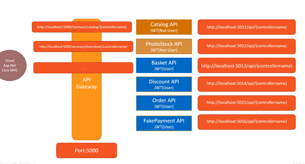

#Microservices

Asp .Net Core 5.0 Teknolojisi ile geliştirilmiş Microservices projesidir. 

Projede tüm microservislerin kullandığı kullanıcı doğrulama sistemi identityserver framework ve asp core identity kullanarak oluşturulmuştur.

API Gateway olarak Ocelot kütüphanesi kullanılmıştır.

Her mikroservice'de farklı veri tabanı kullanılmaya çalışılmıştır. Kullanılan veri tabanları postgresql, mssql, redistir.

Microservislerde n-tier architecture, domain driven design mimarileri kullanılmıştır.

Mikroservice'ler arası senkron ve asenkron iletişim üzerinde durulmuş ve örnekler gerçekleştirilmiştir. Eventual
Consistency uygulamaları yapılmıştır.

Mikroservicelerin test edildiği client projesi asp core mvc projesi olarak oluşturulmuştur.

Projede yer alan servisler : 

- ***Identity Server (Merkezi Kullanıcı Doğrulama Sistemi)***
- ***Asp Core MVC (Client)***
- ***Catalog Microservice***
- ***PhotoStock Microservice***
- ***Basket Microservice***
- ***Discount Microservice***
- ***Order Microservice***
- ***Payment Microservice***

